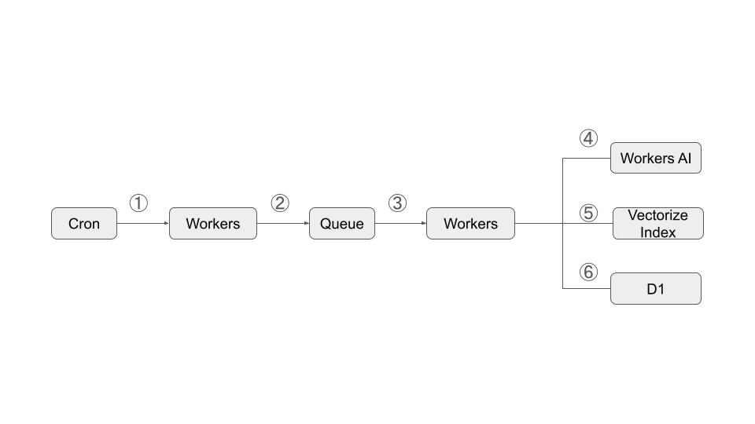
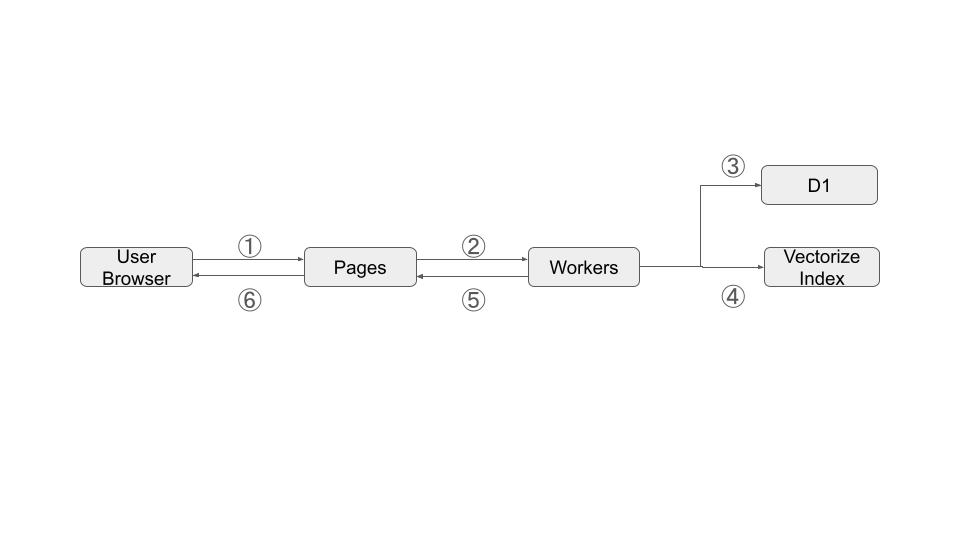

*This is a submission for the [Cloudflare AI Challenge](https://dev.to/devteam/join-us-for-the-cloudflare-ai-challenge-3000-in-prizes-5f99).*

Hello there! I'm Narimasa Sakurai(github account: wonyx), a software engineer from Japan.

## What I Built

<!-- Tell us what your app does! -->
I built a simple feed reader that suggest related feed entries.
The app uses `@cf/baai/bge-large-en-v1.5` model to generate text embeddings for each feed entries and then uses cosine similarity to suggest related entries.

## Demo

<!-- Share a link to your deployed solution on Workers or Pages, and add a screenshot or video embed of your app here. -->

## My Code

<!-- Show us the code! Share a public link to your repo and be sure to include a README file with installation instructions. We also encourage you to add a license for your code.  --> 
This is a link to the [repo](https://github.com/wonyx/cloudfeed).

## Journey

<!-- Tell us about your process, the task types and models you used, what you learned, anything you are particularly proud of, what you hope to do next, etc. -->
### Process
I saw an article about the Cloudflare AI Challenge and decided to participate in this.
First, I tried to get a better understanding of Cloudflare by reading the blogs posted on Developer Week. I was a bit intimidated because I only knew a little about Cloudflare.
I had only used Cloudflare Pages to deploy a static Nextjs site.

- What tasks can Workers AI handle?
- What kind of system configuration would be suitable?
- What is the difference between Pages and Workers?

I learned a lot about the differences between Pages and Workers.
Next, what tasks are suitable for AI to solve? I asked myself.
And I decided to create an RSS Feed Reader.
Here's why.

- RSS provides an interface that makes it easy for machines to gather information.
- Since I use an RSS reader every day, I thought it would be nice if AI could suggest articles of my interest for me.

And then, I started to develop the app.

First, I develop a simple pipeline to fetch feed entries and store them in the D1 using Queue and Cron Triggers.
Second, I tried to evalutate models that are suitable for task suggesting feed entries.
I tried to use Text Generation Models such as `llama-2-7b-chat-fp16`, `mistral-7b-instruct-v0.2`, `gemma-7b-it` but it is difficult to suggest related feed entries.

So I decided to use `@cf/baai/bge-large-en-v1.5` model to generate text embeddings for each feed entries and then use cosine similarity to suggest related entries.

### Overview
This is an overview of the part of system that use Workers AI and Vectorize.
I think this is not RAG but I reffered [the RAG Architecture](https://developers.cloudflare.com/reference-architecture/diagrams/ai/ai-rag/).

#### Indexing Feed Entries

1. Cron trigger worker to fetch feed periodically.
2. send feed entries to the Worker through the Queue.
3. dequeue feed entries from the Queue.
4. calculate feed entry vectors from the title and description using the Worker AI.
5. store feed entry vectors into the Vectorize.
6. store feed entries and feed vectors into the D1.

#### Suggesting Related Entries

1. User read a feed entry, then browser requests to the Pages to get related entries.
2. Pages requests to the Worker to get related entries.
3. Workers get the feed entry vectors user read from the D1.
4. Workers requests to the Vectorize to get similar feed entries with metadata.
5. Workers filter entries by similarity score and get feed entry ids from metadata, get similar feed entries by ids from the D1, and then return them to the Pages.
6. Pages return related entries.

### What I Learned
What I learned from this project is following:

- How to use Cloudflare Tech Stacks, such as:
  - Pages
  - Workers
  - Workers AI
  - Vectorize
  - D1
  - Queue
  - Cron Triggers

- Evaluate these tech stacks working on Cloudflare
  - Nextjs on Pages with App router and Server Actions works fine!
  - hono
    - I chose hono as a backend framework, instead of [RPC](https://blog.cloudflare.com/javascript-native-rpc) for now. because RPC doesn't work on `nextjs on pages` on my local environment. I think RPC is better for a production to protect workers fetch from the Internet.
  - drizzle orm
    - almost works fine, but I faced [this issue](https://github.com/drizzle-team/drizzle-orm/issues/555). It confused me a little bit. 
- vector similarity is hard.

    Difficult to predict behavior compared to full-text search engines. It is difficult to determine if the similarity results are correct.
However, it can resolve similarities that full-text search engines cannot. Full-text search engines can also calculate similarity based on tokens, but with a different approach. Probably need to provide synonyms, etc.
    Also difficult to determine the similarity threshold. I set the threshold to 0.66, but I'm not sure if it's the best value.

### Proud of
Actually, English is not my first language, so I'm proud of submitting `MY FIRST POST` in English.
And I'm proud of joining this Cloudflare AI Challenge.

### Next
Following are the next steps I plan to take:

- Using RPC between the Pages and Workers.
- Try to build RAG Architecture.

<!-- Let us know if your project utilized multiple models per task and/or if your project used three or more task types. If so, you may qualify for our additional prize categories! If not, please remove this section. -->

<!-- Team Submissions: Please pick one member to publish the submission and credit teammates by listing their DEV usernames directly in the body of the post. -->

<!-- Don't forget to add a cover image or an additional tag to this post (if you want). -->

<!-- Thanks for participating! -->

## Thank you for
- `dev.to` users reading this post.
- Cloudflare for hosting this challenge.
- Github Copilot helping me everything such as writing this post, coding, etc!
